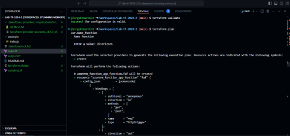
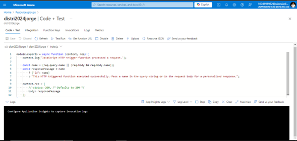

# Despliegue de una Aplicación Web con Terraform y Azure

Este proyecto muestra cómo configurar y desplegar una aplicación web utilizando Terraform para gestionar recursos en Azure. A continuación, se describe el proceso paso a paso, desde la creación de los recursos hasta la implementación de la aplicación y las pruebas finales.

## Pasos del Despliegue

### 1. Creación del Resource Group
El primer paso consiste en crear un **Resource Group**, que actúa como contenedor lógico para todos los recursos de Azure que se utilizarán.

### 2. Creación de la Storage Account
Después, se configura una **Storage Account** que almacena los datos necesarios para el funcionamiento de la aplicación. Este recurso es esencial para la **Function App**.

### 3. Creación del Service Plan
El **Service Plan** define el nivel de servicio que se asignará a la **Function App**. En este caso, se utiliza un plan de consumo, que ajusta el costo según la demanda de la aplicación.

### 4. Implementación de la Function App
La **Function App** es el servicio que aloja el código de la aplicación. Se configura para manejar solicitudes HTTP, ejecutando las funciones según sea necesario.

### 5. Configuración del Código y Pruebas
El código de la aplicación, en un archivo `index.js`, responde a solicitudes HTTP de tipo GET y POST. Las pruebas se realizan accediendo a la aplicación desde un navegador o utilizando herramientas de llamadas HTTP.

### 6. Generación de la URL de la Function App
Terraform genera una URL para acceder a la **Function App** tras su despliegue. Esto se logra utilizando un bloque de código en `output.tf`.

## Archivos Utilizados

- **main.tf**: Define los recursos principales, como el **Resource Group**, **Storage Account**, **Service Plan** y **Function App**.
- **output.tf**: Muestra la URL generada para acceder a la aplicación.
- **variables.tf**: Contiene las variables que permiten parametrizar los nombres y ubicaciones de los recursos.

## Requisitos Previos

- Cuenta en Azure con permisos para crear recursos.
- Terraform instalado localmente.

## Instrucciones para el Despliegue

1. Clonar este repositorio.
2. Ejecutar `terraform init` para inicializar el entorno.
3. Ejecutar `terraform apply` para desplegar los recursos en Azure.

4. Acceder a la URL generada y verificar que la aplicación funcione correctamente.

## Vista desde Azure

A continuación, se puede visualizar la Function App en azure que fue creada:

Además, se presenta una imagen del code test:

